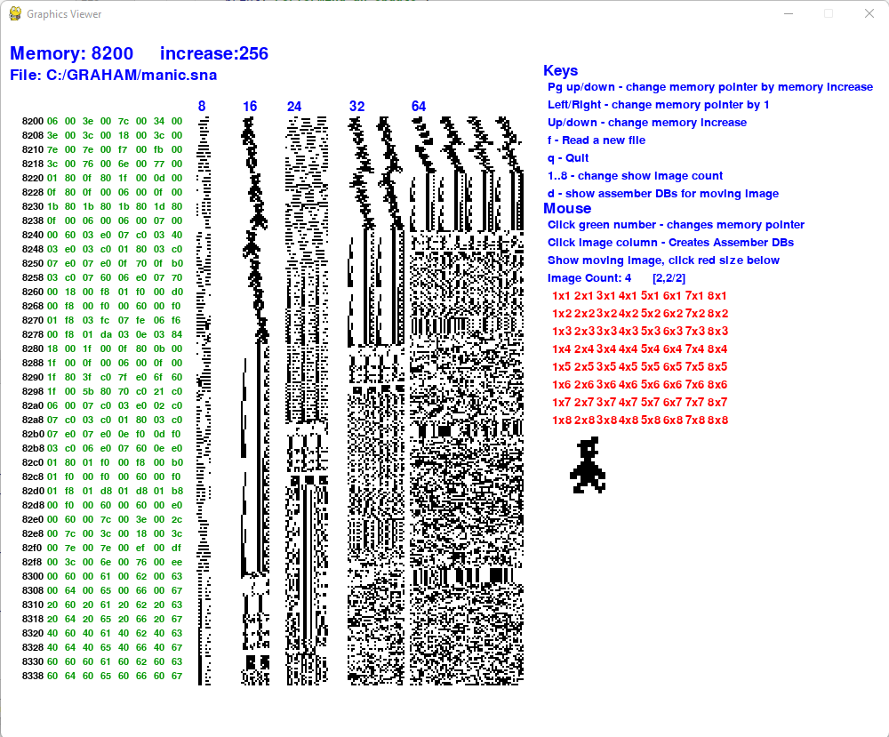
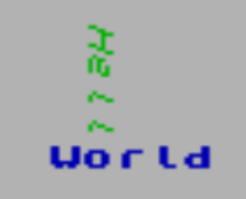

# ZX Spectrum Utilities: (zx-spectrum-utils)
Here are a few utility programs that can be used with the ZX Spectrum roms as well as assember macros.
The langage of choice here is Z80 Assember and Python so it would help if you have know in these langauges.
The ZX Spectrum is one of the first home computers from the early 1980s.
More information can be found here: https://en.wikipedia.org/wiki/ZX_Spectrum

## 1. Graphics Viewer: graphics_viewer
Lets start with a Python program,
graphics_viewer can be used to pull in a spectrum file like a snap, z80 or trz file and
see the content as images. 
The idea of this tool is to allow the user to find graphics in the old games
and be able to have fun seeing them and also display the assembler DBs that
would be required to created them. 
Below is a screen shot



There are a few key concepts to understand when using this program:
* file: You are displaying the content of a file on the screen in a graphical format in the hopes to find graphics
* memory: The memory pointer is shown in the top left corner and this is controlled by the arrow keys
* increase: Is the value that memory will change when certain keys are pressed. Changing this number will allow you to move around memory either more quickly or more refined
* columns: There are several columns and these are described below
* moving image: Images can be seen as moving by placing them on top of each other over time. For this we need an image count and size. In the example shown in the screen shot above it is using a 2x2 image size and an image count of 4. The red text "2x2" would need to be pressed.
* image count: the number of images in the moving image section from 1 to 8.
* red text: This is the size of the image you are interested in displaying for the moving graphic

**Columns**
* first column: Is the memory location, see how the number increase as it goes down the screen
* Green text: This is the actual content of that memory location
* 8 - 8 bit sized images
* 16 - 16 bit sized images
* 24 - 24 bit sized images
* 32 - 32 bit sized images
* 64 - 64 bit sized images

**Keys**
* Up/down - move the memory pointer by the increase amount (fast memory movement)
* Left/right - move memory pointer by 1 (refined/slow movement)
* Page up/down - change the memory increase amount
* f - Read a new file
* d - Show assembler DBs for the moving image
* 1,2,3,4,5,6,7,8 - the number of images in the moving image
* q - quit (or escape)

**Mouse Control**
* Click green text: Move the memory pointer to that value
* Click numbered column (8, 16, 24, 32, 64): Dumps that columns assember DBs
* Click red text: Select the moving image size. For example 2x2

### Getting Started
* Install python: https://www.python.org/downloads/
* Start a command prompt, clone the repo locally, and change to the root folder
* It is probably best to create a local virtual environment under the root, lets say under venv
  * python -m venv venv
* To active this python version
  * venv\Scripts\activate 
* update pip (optional)
  * python.exe -m pip install --upgrade pip 
* Install all the pre-req modules
  * pip install -r requirements.txt
* Run Graphics Viewer:
  * python graphics_viewer.py

## 2. A library of ASM macros and definitions
Now, lets move over to some macros and definitions that have been supplied in the asm folder.
You should start by opening colour.asm, helper.asm and print_letters.asm.
This will give you a good understanding of what they can be used for.
Note: that the assembler of choice is [sjasmplus](https://github.com/sjasmplus/sjasmplus) as it is very powerful.

### Getting started
If you would like to run these from the command line then first install 
sjasmplus and update the run.cmd file at the top of the file.
Set **emulator** to point to your emulator and set **sjadm_path** to the sjasmplus executable. 
Once these have been configured, you can start a command prompt, navigate to the examples directory, 
and use **run filename** to run the examples.
Check out this video for getting started.
[](https://youtu.be/HWNXIYY29Jc)

Getting Started Presentation: https://docs.google.com/presentation/d/15R4BytHgwOTKLnwlgieuS_XoJJmri6D3qJiumF-eZEU/edit#slide=id.p

### Printing Letters - Hello World (hello_world.asm, print_letters_sample.asm)
There is also a examples folder which shows how to make use of some of these libraries.
Lets look at the hello_world.asm first. It can be broken into the following sections:

Section 1 - this is just some comments at the top - please read them
```
; This is a sample program "Hello World" for print_letters asm library
;  0123456789       <-- This is the screen position
;  1     H               Hello starts at 6,1 going down, and italics, and green
;  2     e               World starts at 5,5 lets do this bold and blue
;  3     l
;  4     l
;  5    World
```

Section  2 - some assembler directives. Comments have been added after the ; for your understanding
```text
    DEVICE ZXSPECTRUM48                 ; Select 48k spectrum as output device
    ORG $8000                           ; Start the output to $8000 memory address
main:                                   ; Just a label - so that the savesna works
    jp start                            ; Jump to the start of the program
    include print_letters.asm           ; Include the print letters library, hence the need for the previous jump
```

Section 3 - the main section. Comments have been added after the ; for your understanding

```text
; //////////////////// MAIN Section     ; This is just a comment
start:                                  ; This is a label that the previous jp jumps to, to start the program
    ld hl,hello_str                     ; Load HL register with the hello string
    COOL_PRINT                          ; Call COOL_PRINT to print the hello string
    ld hl,world_str                     ; Load HL register with the world string
    COOL_PRINT                          ; Call COOL_PRINT to print the world string
l1  jr l1                               ; Nothing else to do here so just continuely loop - you program would go on to do more here
```
Importantly, writing this code is super easy to print stuff to the screen!

Section 4 - The data section, which is how you can define the hello and world strings that were previously printed.
Notice the pAt,pDown,pInk and so on - these are control characters that are part of the string to get cool print to do special things.
Understanding these control characters will allow you to make get screens. 
Check out print_letters.asm for all these control characters.
```text
; //////////////////// Data Section
hello_str    dz  pAt,6,1,pDown,pItalic,pInk,Green,"Hello"       ; Notice how this map to the comments
world_str    dz  pRat,5,5,pBold,pInk,Blue,"World"               ;    at the start of this program
```
Section 5 - lastly, just create the snap file. Importantly, this is the same name as the asm file.
```text
    SAVESNA "hello_world.sna", main
```

Running this sample as follows: **run hello_world**
<p>The output looks as follows: 



In your program you will just need to pull in the include, add some strings, then call cool print.
A more elaborate example can be found with print_letters_sample.asm. 
The output of this looks like this:


Notice there are many control characters here for things like bold, italic, strike through,
underscore, rotation, mirroring, colours, flashing, bright, and many others.
These can all be combined with each other as needed.
One thing that is not so obvious is that as you set controls in place they stay in place.
This can be reset back to defaults by either calling pReset or pRat which is a reset followed by a screen location.

### Colours Module (colour.asm)
Simply has a list of colours that you can use.

### Input Module (input.asm)
An easy way to find what keys have been pressed. 
Just include it at the top of your program, 
add the macro "GET_KEYS_PRESSED" to your game loop.
Finally, test if a key is pressed using something like:
```text
    include "input.asm"
    ...
game_loop
    GET_KEYS_PRESSED
    ld a,(keys2)                    ; Keys "yuiop"   if p is pressed (first bit)
    and 1                           ; Just checking for first bit
    _IF label1, a, 1
        call move_right_key_pressed ; call the routine to deal with p pressed
    _END_IF_NO_ELSE label1
```
Here's a table for the keys which is in the code
```text
         BITS
       4 3 2 1 0   
keys0  B N MSsSp    
keys1  H J K LEn    
keys2  Y U I O P    
keys3  6 7 8 9 0    
keys4  5 4 3 2 1    
keys5  T R E W Q    
keys6  G F D S A    
keys7  V C X ZCs    
```
Note: If you define DEBUG to TRUE then the keys being pressed will be 
displayed at the bottom of the screen.

### Helper module (Helper.asm)
This module is here to provide LOTS of great macros to make coding much 
simpler for the developer. 
Here is a brief explanation of what they are at a high level.
The developers favourite ones are the _IF set and _IX set which 
he uses all the time to cut down the number of lines of code and 
increase readability.

```text
      ; sample IF statement
      _IF label1, a, 0            <-- All ifs need a label which allows then to be nested if needed. This compares reg A with 0 and if true does the next block
          ; do what ever....
      _ELSE label1                <-- If reg A is NOT zero then it will do this block
          ; otherwise do this....
      _END_IF
```

```text
        ; Sample IX macros. Imagine you had created a structure, and set IX pointing to that structure, then use these macros to access their offset
        ld ix, p_init_memory_values
        IX_GET b, p_mem.incx              <-- Equivalent to ld a,(IX+p_mem.incx) : ld b,a
        IX_LD p_mem.incx, p_mem.incy      <-- Equivalent to: ld a,(IX+p_mem.incy) : ld (IX+p_mem.incx),a
```

#### All the IF MACROS
The first set are short jumps like jr, and the secondf set use JP
```text
	macro	_IF	ifinstance,_reg,_value
	macro	_IF_NOT	ifinstance,_reg,_value
	macro _ELSE ifinstance
	macro	_END_IF ifinstance
	macro	_END_IF_NO_ELSE ifinstance
	macro	_LONG_IF	ifinstance,_reg,_value
	macro	_LONG_IF_NOT	ifinstance,_reg,_value
	macro _LONG_ELSE ifinstance
	macro	_LONG_END_IF ifinstance
	macro	_LONG_END_IF_NO_ELSE ifinstance
	macro	_LONG_IX_IF	ifinstance,_offset,_value
	macro	_IX_IF	ifinstance,_offset,_value
```


#### For macros
For loop allows a loop for a register
```text
	macro _FOR	reg, _start, end, step
	macro _END_FOR reg,
```

#### ALL IX macros
```text
	macro IX_GET _reg?, _offset      
	macro IX_SET _offset,_reg?
	macro IX_LD _offset,_offset2
	macro IX_INC _offset
	macro IX_DEC _offset
	macro IX_ADD _offset, value
	macro IX_SUB _offset, value
	macro IX_CP _offset1, _offset2   
	macro IX_GET2 _reg1?, _reg2?, _offset
  	macro IX_SET2 _offset, _reg1?, _reg2?

```

#### MEMORY macros
Which are similar to the IX macros but directly to memory
```text
	macro MEM_SET _mem_loc,_value
	macro MEM_GET reg,_mem_loc
	macro MEM_INC _mem_loc
	macro MEM_DEC _mem_loc
	macro MEM_ADD _mem_loc,_value
	macro MEM_SUB _mem_loc,_value
```

#### Dealing with the screen
```text
	macro CALC_SCREEN_LOCATION screenyx8
	macro CALC_SCREEN_LOCATION8x8 screeny8x8
	macro CALC_COLOUR_LOCATION8x8 screeny8x8
	macro CALC_COLOUR_LOCATION screenyx8
	macro INC_Y_SCREEN_LOCATION
	macro INC_Y_COLOUR_LOCATION
	macro SET_SCREEN_COLOUR colour_num
	macro SET_BORDER_COLOUR colour_num2
	macro CLS
```

#### Miscellaneous
```text
	macro DIV_8 reg
	macro MIN _arg  ; compare argument with A, A will hold the minimum
	macro MAX _arg  ; compare argument with A, A will hold the maximun
	macro MULTIPLY word_arg, byte_arg
	macro STRING_SIZE mem_loc
	macro CALC_MEMORY_OFFSET mem_start, number
	macro INIT_MEMORY mem_start,mem_length
	macro HEX_TO_STRING
	macro RANDOM	; return a random 8 bit number in A
```

## 3. Developers / Pull Requests
If you would like to contribute to this repo then please submit a pull request.
Code should be compliant to flake8 and pylint.
Pull requests should contain:
* APP_VERSION: An updated version number
* CHANGELOG.md: An entry in the changelog so that we know when things were introduced
* Add any additional files to the quick_test.cmd
* Whatever else you want commit
* Ensure quick_test.cmd runs without any errors
